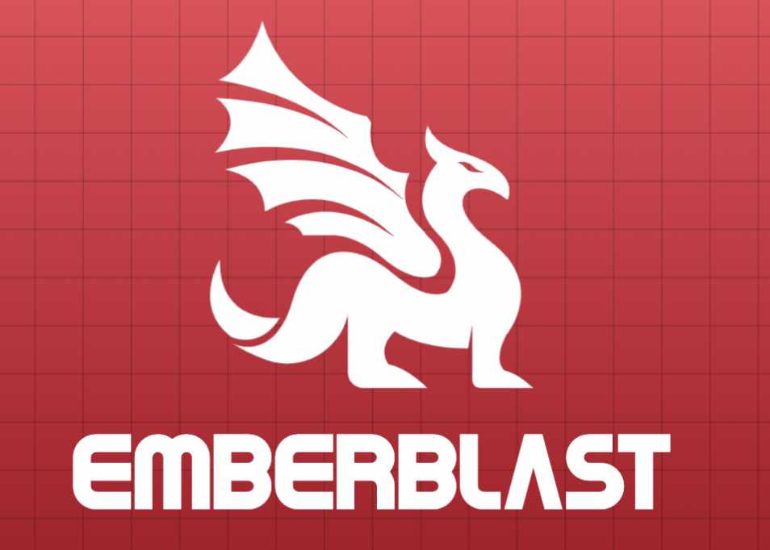

# Emberblast - Python CLI RPG Game

Welcome to 🔥 **Emberblast**  🔥

This is an Open Source Python Command Line RPG Arena game, it's a turn based game, that is meant
to have many game styles, but currently we only have Deathmatch, which is all against all in an 
arena.



## Game Rules

You basically need to select a job and a race for your character, each job and races
has their own skills and attributes points, you will start in a random position of the map,
and the goal of Deathmatch, it's being the last one to survive on the field.

The game flows into turns, where each of the characters will have to decision between the following actions:
- Move
- Attack
- Defend
- Item
- Hide
- Search
- Skill

In each turn, each player is allowed to move, plus one of the another remaining actions.
All the players has their character's attributes, that are:
- Health Points(HP): Represents the remaining life.
- Magic Points(MP): Used for casting magic.
- Move Speed: Determines how many tiles of the map the char is capable of moving.
- Strength: Used as base multiplier when inflicting physical damage.
- Intelligence: Used as base multiplier when inflicting magical damage.
- Accuracy: The probability that a user has to hit a target.
- Armour: Base multiplier to reduce physical damage taken.
- Magic Resist: Base multiplier to reduce magical damage taken.
- Will: Increases the probability of being the first to play in the turn, earn more xp and find an item.

The maps are compounded by tiles, represented by a graph, each vertex of a graph is one tile, and characters move on top of them.

By executing actions, characters levels up, increasing their attributes, and learning new skills.

The game adopts the mentality to be as customizable as possible, which means that apart from the 
default classes, races, skills and items, if you want, you can create your own ones and include it 
in the game, or if you just want to enjoy, just grab and play it as the default version.

For accessing all the playing manual with all the detailed rules, access the [GAME MANUAL]().

## Docker

You can also run this game as a Docker container, you can either pull the official image from our public registry
[registry.emberblast.docker.cc](registry.emberblast.docker.cc).

Our build a custom docker image, and run it, for building the Docker image, run the following command:
```shell
docker build -t emberblast .
```x

For running the game:
```shell
docker run -it emberblast:latest
```

Don't forget the ```-it```argument when starting the container, because as Emberblast it's a
terminal interactive game, without this argument, you won't be able to interact with the console.

## TODO List

- add attribute to SideEffect class to skip turns from certain players
- implement skills to find items on the map
- Add more skills for knight
- Add more custom skills
- Add more side-effects
- Add probability to side-effects
- Test Level up velocity

